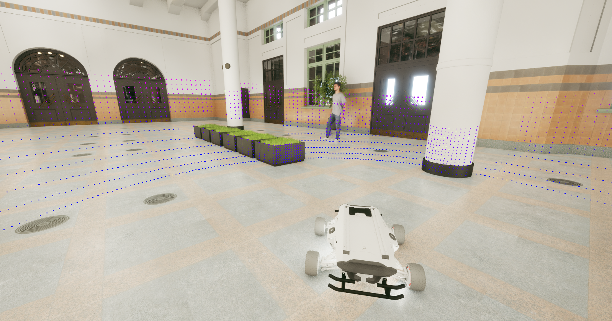

# SimPRIVE

**Sim**ulation framework for **P**hysical **R**obot **I**nteraction with **V**irtual **E**nvironments

[](https://arxiv.org/abs/2504.21454)  
https://github.com/retis-ai/SimPRIVE/

---

## 🧠 Overview

**SimPRIVE** is a flexible simulation framework designed to let physical robots interact with virtual environments using a vehicle-in-the-loop simulation paradigm. It supports any ROS2-enabled robot.

> 📢 SimPRIVE was accepted for publication at the 2025 IEEE Intelligent Transportation Systems Conference.

We welcome collaborations on extensions, new features, and specific applications!

---

## 📄 Research

- [Read the pre-print](https://arxiv.org/abs/2504.21454)
- [Code Repository](https://github.com/retis-ai/SimPRIVE/)

### Related Projects from Retis Lab

- [TrainSim](https://ieeexplore.ieee.org/stamp/stamp.jsp?arnumber=10205499): Simulation framework for railway scenarios
- [SynDRA dataset](https://syndra.retis.santannapisa.it/): Synthetic dataset for railway applications
- [Carla-GeAR](https://carlagear.retis.santannapisa.it/): CARLA-based tool for evaluating neural network adversarial robustness

---

## 🎬 Demo

> _Watch the demo above showing SimPRIVE in action._


---

## 🖼️ Screenshots



---

## 🛠️ Installation Instructions

### UE5 Setup

1. Create a new UE5.2 project (any template).
2. Place the **SimPRIVE plugin** in your project's `Plugins` folder.
3. Add the [ROSIntegration plugin](https://github.com/retis-ai/ROSIntegration) to `Plugins`.
4. Enable both plugins in UE Editor (`Edit → Plugins`). Restart if needed.
5. Edit `SimPRIVE/Content/Config/IPConfig.json` to match your ROS2 IP and PORT.
6. In `Project Settings → Maps & Modes → Game Instance Class`, set it to `SimPRIVEGameInstance`.

#### 🌍 Level Setup

1. Create a new level.
2. Set collision for each object:
   - Enable "Generate Overlap Events"
   - Set custom collision presets
   - Enable Query and Physics
   - Set Collision Responses to "Overlap" (except Visibility Trace → Block)
3. Add the **Rover** object and adjust height.
4. Add **SpawningManager** and define splines for object spawning.
5. Fill in Static/Skeletal Mesh and Animation Libraries.
6. Add **ROSOrchestrator**:
   - Assign Rover and SpawningManager
   - Define ROS topic names (odometry, reset, pause, resume)
   - Set number of objects/pedestrians

> ⚠️ Currently supports `nav_msgs/Odometry` only. Contact us for other message types.

### 🔁 ROS2 Setup

1. Install [rosbridge_suite](https://github.com/tsender/rosbridge_suite/tree/ros2)
2. Launch the TCP server:
   ```bash
   ros2 launch rosbridge_server rosbridge_websocket_launch.xml
   ```
3. Ensure a ROS node is publishing to `/odom`.
4. Click **PLAY** in Unreal Engine — you're good to go!

---

## 📚 Citation

If you use SimPRIVE in your research, please cite:

```bibtex
@article{nesti2025simprive,
  title={SimPRIVE: a Simulation framework for Physical Robot Interaction with Virtual Environments},
  author={Nesti, Federico and D'Amico, Gianluca and Marinoni, Mauro and Buttazzo, Giorgio},
  journal={arXiv preprint arXiv:2504.21454},
  year={2025}
}
```
