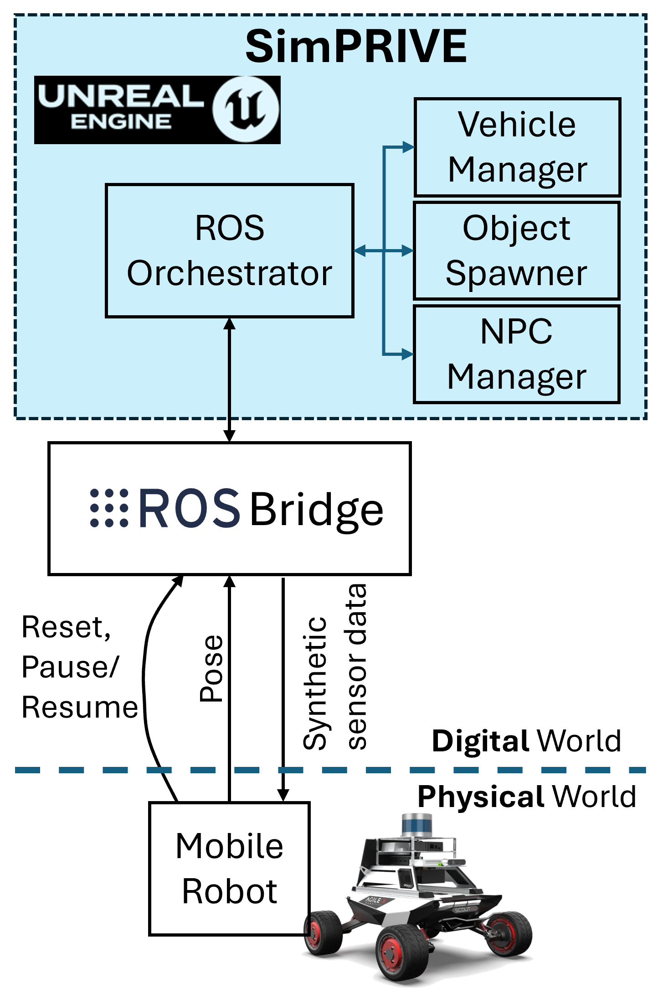
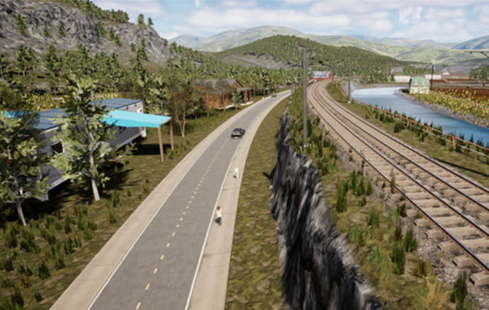
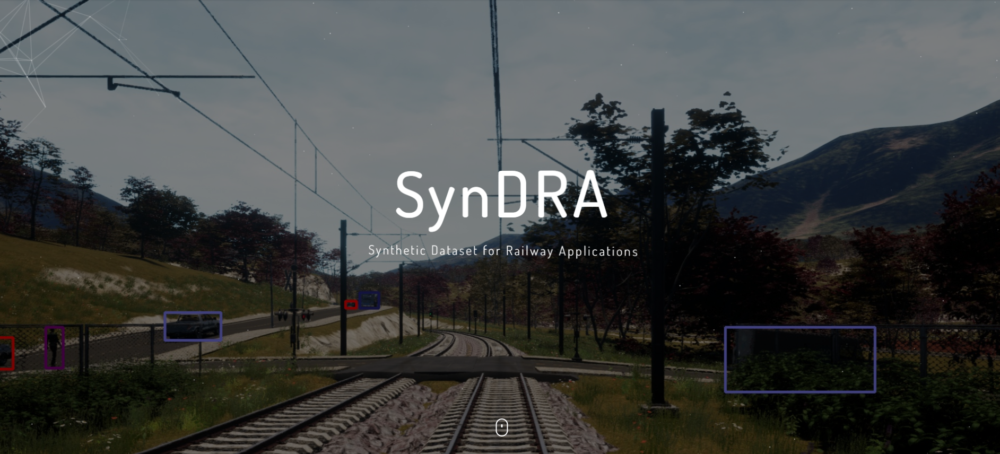
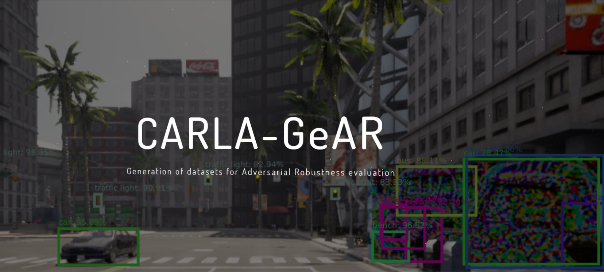

<div class="text-center">
  <h1>SimPRIVE</h1>
  <p class="lead">a <b>Sim</b>ulation framework for <b>P</b>hysical <b>R</b>obot <b>I</b>nteraction with <b>V</b>irtual <b>E</b>nvironments</p>
</div>

---

## 🧪 SimPRIVE

SimPRIVE is a flexible simulation framework designed to let physical robots in the real world interact with virtual environment, adopting a vehicle-in-the-loop simulation paradigm. SimPRIVE allows interaction with any ROS2-enabled robot. This first version is specifically designed for vehicles, but additional features will be released. SimPRIVE was accepted for publication at the 2025 IEEE Intelligent Transportation System Conference.  

<strong>Don't hesitate to contact us to collaborate on extensions, new features, and specific applications!</strong>


---
<div style="text-align: center;">
  
  <p style="font-style: italic; font-size: 0.9em;">Figure 1: SimPRIVE platform architecture and workflow overview.</p>
</div>

## 📄 Research
📎 [Read the official paper]([https://arxiv.org/abs/2504.21454](https://ieeexplore.ieee.org/document/11423662))

📎 [Read the pre-print](https://arxiv.org/abs/2504.21454)

🐙 [Code Repository](https://github.com/retis-ai/SimPRIVE/)

### Check out our research on simulators at Retis Lab!
<div class="research-cards">
  <div class="research-card">
    
    <div class="card-content">
      <h4><a href="https://ieeexplore.ieee.org/stamp/stamp.jsp?arnumber=10205499">TrainSim</a></h4>
      <p>Simulation framework for railway scenarios</p>
    </div>
  </div>
  
  <div class="research-card">
    
    <div class="card-content">
      <h4><a href="https://syndra.retis.santannapisa.it/">SynDRA dataset</a></h4>
      <p>Synthetic dataset for railway applications</p>
    </div>
  </div>
  
  <div class="research-card">
    
    <div class="card-content">
      <h4><a href="https://carlagear.retis.santannapisa.it/">Carla-GeAR</a></h4>
      <p>A CARLA-based tool and dataset for neural network adversarial robustness evaluation</p>
    </div>
  </div>
</div>

---

## 🎬 Demo

<!--div class="video-container">
  <iframe width="560" height="315" src="https://www.youtube.com/embed/your_video_id" frameborder="0" allowfullscreen></iframe>
</div-->

<div style="text-align: center; margin: 20px 0;">
  <video width="560" height="315" controls src="images/SimPRIVE_demo_compressed.mp4" style="max-width: 100%; height: auto;">
    Your browser does not support the video tag.
  </video>
</div>


> _Watch the demo above showing SimPRIVE in action._

---

## 📸 Screenshots

<div class="gallery">
  
  
  
  
</div>

---

## 🛠️ Instructions
The setup includes two phases: (i) Unreal Engine setup, and (ii) ROS2 setup. 

For UE, it is recommended to use a Windows 11 machine and download UE5.2.
For ROS2, it is recommended to use Ubuntu 22 and ROS2 Humble.


---
### ⚙️ UE5 setup

1. Create a new UE5.2 project (use any desired template).
2. Download and place **SimPRIVE plugin** in your project's `Plugins` folder.
3. Download and place UE5-compatible **[ROSIntegration plugin](https://github.com/retis-ai/ROSIntegration)** in `Plugins`.
4. Enable both plugins from the UE editor (Edit->Plugins). Restart if necessary.
5. Edit the plugin JSON config (`SimPRIVE/Content/Config/IPConfig.json`) to set the correct ROS2 **IP** and **PORT**. This must match the IP and port of your ROSBridge setup. 
6. Go to `Project Settings → Maps & Modes → Game Instance Class` and set it to `SimPRIVEGameInstance`.

#### 🌍 Level Setup

1. Create a new level.
2. Set collision for each object of the environment. Enable "Generate Overlap Events" and **Set custom collision presets** (important for interactions). The collisions have to be enabled (Query and Physics), while the Collision Responses must be set to "Overlap" for every channel except for the Visibility Trace Response (Block).
3. Add the **Rover** object and define the height in the Details panel. The static mesh assigned by default is the AgileX Scout Mini but it can be customized.
4. Add the **SpawningManager**. You must create a few splines (`Add spline` button). These splines define the region where the objects are going to spawn when the reset topic is published in.
5. Fill in the Static Mesh Library with meshes of your choice to allow object spawning; fill in the Skeletal Mesh and the Animation Libraries with assets of your choice to spawn animated objects.
6. Add **ROSOrchestrator** and:
   - Assign references to Rover and SpawningManager objects.
   - define ROS topic names (odometry, episode reset/pause/resume).
   - define the number of objects/pedestrians to be spawned.

  
Note: this version only supports messages of type `nav_msgs/Odometry`. For additional types, feel free to contact us.

---
### 🔄 ROS 2 Setup
Install **[rosbridge_suite](https://github.com/tsender/rosbridge_suite/tree/ros2)**
1. Launch the ROS 2 TCP server:

    ```bash
    ros2 launch rosbridge_server rosbridge_tcp_launch.xml
    ```

2. Ensure a ROS node is publishing to `/odom`.
3. Click **PLAY** in Unreal Engine – everything should work!

---

## 📚 Citation

To cite this work, use the following BibTeX entry:

<pre>
@INPROCEEDINGS{11423662,
  author={Nesti, Federico and D'Amico, Gianluca and Marinoni, Mauro and Buttazzo, Giorgio},
  booktitle={2025 IEEE 28th International Conference on Intelligent Transportation Systems (ITSC)}, 
  title={SimPRIVE: A Simulation Framework for Physical Robot Interaction with Virtual Environments}, 
  year={2025},
  volume={},
  number={},
  pages={907-913},
  keywords={Navigation;Software algorithms;Virtual environments;Reinforcement learning;Robot sensing systems;Rendering (computer graphics);Digital twins;Collision avoidance;Robots;Engines},
  doi={10.1109/ITSC60802.2025.11423662}}

</pre>

---

<style>
.video-container {
  position: relative;
  padding-bottom: 56.25%;
  height: 0;
  overflow: hidden;
  max-width: 100%;
}
.video-container iframe, .video-container object, .video-container embed {
  position: absolute;
  top: 0;
  left: 0;
  width: 100%;
  height: 100%;
}
.gallery {
  display: flex;
  flex-wrap: wrap;
  gap: 10px;
  justify-content: center;
}
  /* Option 1 styles */
.research-links {
  display: flex;
  flex-wrap: wrap;
  gap: 20px;
  margin: 20px 0;
}

.research-item {
  text-align: center;
}

.research-item a {
  display: block;
  text-decoration: none;
  color: inherit;
}

.research-thumb {
  width: 150px;
  height: 100px;
  object-fit: cover;
  border-radius: 8px;
  margin-bottom: 8px;
  transition: transform 0.2s;
}

.research-thumb:hover {
  transform: scale(1.05);
}

/* Option 2 styles */
.research-cards {
  display: flex;
  flex-wrap: wrap;
  gap: 20px;
  margin: 20px 0;
}

.research-card {
  flex: 1;
  min-width: 250px;
  border: 1px solid #ddd;
  border-radius: 8px;
  overflow: hidden;
  transition: box-shadow 0.2s;
}

.research-card:hover {
  box-shadow: 0 4px 8px rgba(0,0,0,0.1);
}

.research-card img {
  width: 100%;
  height: 150px;
  object-fit: cover;
}

.card-content {
  padding: 15px;
}

.card-content h4 {
  margin: 0 0 10px 0;
}

.card-content a {
  text-decoration: none;
  color: #0066cc;
}
</style>
